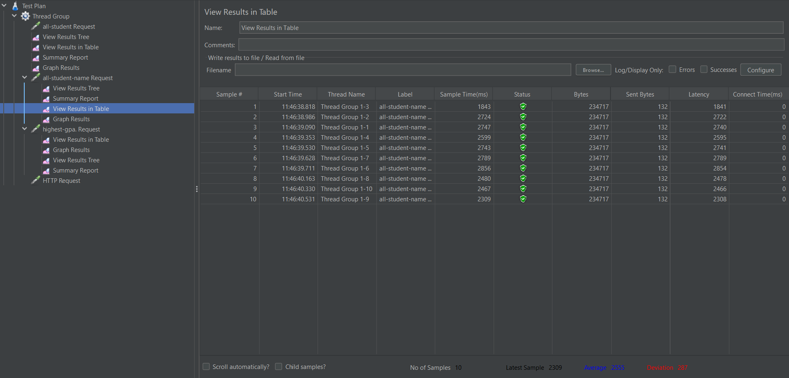
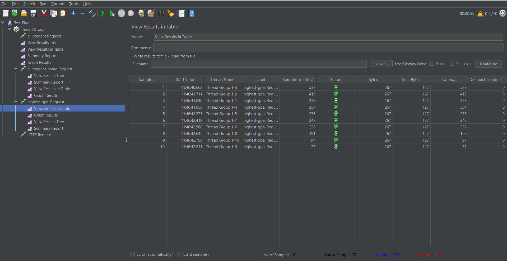
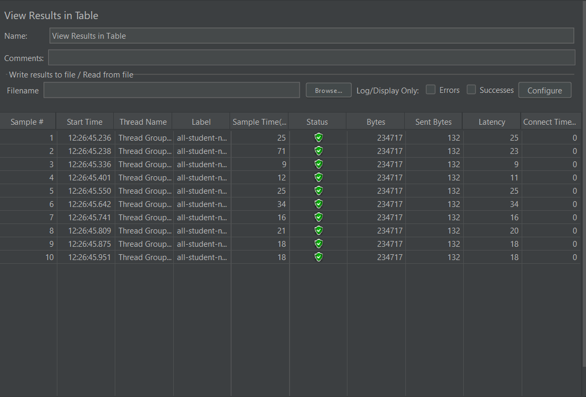
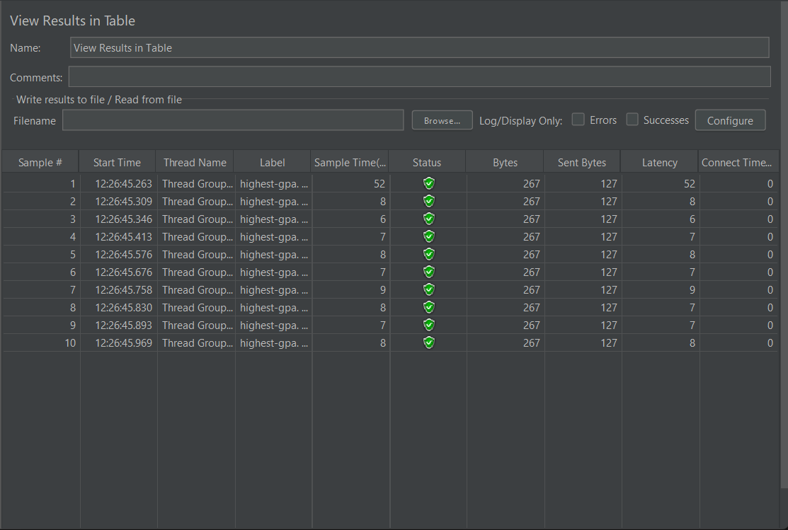
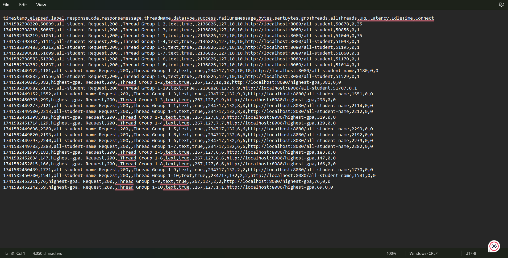

## JMeter before the optimization

## JMeter before the optimization

### Explanation

After the optimization, we can see a clear diffrence from the JMeter sample time, the method before the optimization need thousands of milisecond to run, but after the optimization the diffrence are so clear, both of the method saw a significant decrease in speed time, even reaching single digit time. This is happening because of the optimization that I did making it so that the method will run significantly faster than before optimization.

## JMeter using command line

